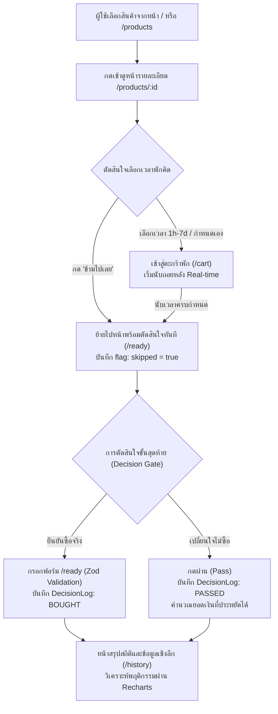

# 📖 Pause — คู่มือการพัฒนาและแผนการทำงานในทีม (Team Guide)

> **มาตรฐานการออกแบบกลาง (Design System):** ทุกคนในทีมต้องยึดถือมาตรฐานจาก [`genesis-DESIGN.md`](./genesis-DESIGN.md) เป็นหลัก เพื่อให้ UI/UX ทั้งเว็บไซต์มีความประณีต สวยงาม และเป็นอันหนึ่งอันเดียวกัน

---

## 🎯 1. ภาพรวมและสถาปัตยกรรมระบบ (System Architecture)

เว็บแอปพลิเคชัน **"Pause — ตะกร้าที่บังคับให้คิดก่อนซื้อ"** มีเป้าหมายเพื่อลดปัญหา **Impulse Buying** (การซื้อของโดยไม่คิด) ผ่านกลไก **Cooling-off Period** (หน่วงเวลาคิด) โดยมีโฟลว์การทำงานและสถาปัตยกรรมข้อมูลดังนี้:



### การจัดเก็บข้อมูล (Data Storage Architecture):
1. **Supabase PostgreSQL Database:**
   - **`Product`**: แคตตาล็อกสินค้า, ราคา, หมวดหมู่, คำอธิบาย, รูปภาพ
   - **`DecisionLog`**: บันทึกประวัติการตัดสินใจ (`BOUGHT` หรือ `PASSED`), ราคา, flag `skipped`, วันเวลา
   - **Storage Bucket (`product-images`)**: จัดเก็บไฟล์รูปภาพสินค้าแบบ Public
2. **Browser LocalStorage (`pause-cart`):**
   - จัดเก็บสถานะตะกร้าพักและเวลานับถอยหลังของอุปกรณ์ผู้ใช้ (Client-side) เนื่องจากระบบไม่มีระบบ Login สมาชิก

---

## 🎨 2. สรุปมาตรฐาน UI จาก `genesis-DESIGN.md` ที่ทุกคนต้องจำ

| คุณสมบัติ | กฎเกณฑ์ที่ต้องปฏิบัติตาม | Tailwind Class / ค่า CSS |
|---|---|---|
| **Primary Color** | สีแบรนด์หลัก ใช้กับปุ่ม CTA, Focus ring, Active Link | `#6366F1` (Indigo), Hover: `#4F46E5` |
| **Success Color** | สีสำหรับสถานะพร้อมตัดสินใจ, ปุ่มยืนยันซื้อสำเร็จ | `#10B981` (Emerald Green) |
| **Destructive Color** | ปุ่มข้ามเวลา, ข้อความ Validation Error | `#EF4444` (Red / Coral) |
| **Text Primary** | ตัวอักษรเนื้อหาหลัก (ห้ามใช้สีดำสนิท #000) | `#0A0A0A` |
| **Text Secondary** | ตัวอักษรคำอธิบายย่อย, วันที่, metadata | `#6B6B6B` |
| **Borders** | ขอบการ์ด, เส้นแบ่ง, เส้นขอบ inputs (1px ละเอียด) | `#E8E8EC` (`border border-[#E8E8EC]`) |
| **Backgrounds** | พื้นหลังหน้าเว็บ = `#FAFAFA`, พื้นหลังการ์ด = `#FFFFFF` | `bg-[#FAFAFA]` / `bg-white` |
| **Radius: Tags** | ป้าย Chip, Inline badge | **`rounded-[4px]`** |
| **Radius: Controls** | **ปุ่มทุกตัว (Buttons), Inputs, Selects** | **`rounded-[6px]`** |
| **Radius: Cards** | **การ์ดสินค้า, กล่องข้อความ, Modal** | **`rounded-[12px]`** |
| **Radius: Pills** | ป้ายวงกลมแสดงจำนวน (CartBadge) | **`rounded-full`** |
| **Typography** | เนื้อหาทั่วไป = `DM Sans`, ตัวเลขนับเวลา/สถิติ = `JetBrains Mono` | `font-sans` / `font-mono` |
| **Card Hover** | การ์ดทุกใบตอน hover ต้องลอยขึ้น -2px พร้อมเงาบาง | `hover:-translate-y-0.5 hover:shadow-md transition duration-200` |

---

## 👥 3. แผนการแบ่งงานและความรับผิดชอบรายบุคคล

```mermaid
graph LR
  subgraph โฟ ["👤 โฟ (Backend & Cart Core)"]
    F1["supabase/schema.sql"]
    F2["scripts/seed.js"]
    F3["lib/products.js"]
    F4["context/PauseCartContext.jsx"]
    F5["app/cart/page.jsx"]
  end

  subgraph กิต ["👤 กิต (Catalog & Insights)"]
    K1["components/ProductCard.jsx"]
    K2["components/SearchFilter.jsx"]
    K3["app/page.jsx"]
    K4["app/products/page.jsx"]
    K5["components/Countdown.jsx"]
    K6["components/HistoryChart.jsx"]
    K7["app/history/page.jsx"]
  end

  subgraph พี ["👤 พี (Navigation & Decision Flow)"]
    P1["app/layout.jsx & components/Nav.jsx"]
    P2["components/CartBadge.jsx"]
    P3["components/PauseButton.jsx"]
    P4["app/products/[id]/page.jsx"]
    P5["lib/schemas/checkout.js"]
    P6["components/CheckoutForm.jsx"]
    P7["app/ready/page.jsx"]
    P8["app/actions.js"]
    P9["app/not-found.jsx & error.jsx"]
  end
```

---

### 👤 3.1 งานของ โฟ — Database Setup, Products API, และระบบตะกร้าพัก

โฟรับผิดชอบโครงสร้างฐานข้อมูล Supabase ทั้งหมด, การสร้างฟังก์ชันเชื่อมต่อฝั่งเซิร์ฟเวอร์, และ Global State จัดการเวลาพักคิด

#### 📁 ไฟล์ที่ต้องรับผิดชอบ:
1. **[`supabase/schema.sql`](./supabase/schema.sql)** — สคริปต์ SQL สร้างตาราง
   - สร้างตาราง `Product` (id, name, price, category, imageUrl, description, createdAt)
   - สร้างตาราง `DecisionLog` (id, productId FK, price, decisionStatus ENUM['BOUGHT', 'PASSED'], skipped boolean, timestamp)
   - สร้าง Index สำหรับ `decisionStatus`, `timestamp`, `category`
   - สร้าง Supabase Storage Bucket `product-images` (Public)
2. **[`scripts/seed.js`](./scripts/seed.js)** — สคริปต์ยัดข้อมูลสินค้าตัวอย่าง
   - นำเข้าสินค้าอย่างน้อย 6-10 ชิ้น พร้อมรูปภาพคุณภาพสูง
   - รองรับคำสั่งรันผ่าน `node scripts/seed.js`
3. **[`lib/products.js`](./lib/products.js)** — ตัวกลางดึงข้อมูลสินค้าจาก Supabase
   - `getProducts({ q, category })`: Query สินค้าพร้อมค้นหาชื่อ (`ilike`) และกรองหมวดหมู่ (`eq`)
   - `getProductById(id)`: Query สินค้าตาม id รายชิ้น (`single()`)
   - มีระบบ fallback ป้องกัน error เมื่อเน็ตหลุด
4. **[`context/PauseCartContext.jsx`](./context/PauseCartContext.jsx)** — หัวใจของระบบ Cooling-off
   - State `items`: โครงสร้าง `{ productId, addedAt, readyAt, skipped }`
   - ซิงก์สองทางกับ `localStorage` (key: `'pause-cart'`)
   - ฟังก์ชัน `addItem(productId, durationHours)`
   - ฟังก์ชัน `removeItem(productId)`
   - ฟังก์ชัน `skipItem(productId)`: เซต `readyAt = now` และ `skipped = true`
   - ฟังก์ชัน `has(productId)`: เช็คว่ามีในตะกร้าหรือยัง
   - คำนวณ `readyItems`: กรองรายการที่พร้อมตัดสินใจ
   - State `devFastForward`: สวิตช์เปิด/ปิดโหมดเร่งเวลาสำหรับนำเสนออาจารย์
5. **[`app/cart/page.jsx`](./app/cart/page.jsx)** — หน้าตะกร้าพัก
   - แสดงรายการสินค้าที่กำลังนับเวลา พร้อมรูป, ราคา และเวลาที่เริ่มพัก
   - วางคอมโพเนนต์ `<Countdown />` ของกิต
   - ปุ่มยกเลิกสินค้าออกจากตะกร้าพัก
   - ปุ่ม Toggle โหมด `devFastForward`
   - ปุ่มลิงก์เชื่อมต่อไปยังหน้า `/ready`

#### ✅ เกณฑ์ความสำเร็จของโฟ (Definition of Done):
- รัน seed ข้อมูลเข้า Supabase สำเร็จ มีข้อมูลในตาราง `Product`
- ฟังก์ชัน `getProducts` สามารถดึงข้อมูลจาก Supabase มาแสดงผลได้จริง
- เมื่อกดเพิ่มสินค้าเข้าตะกร้า ข้อมูลถูกเซฟลง `localStorage` รีเฟรชหน้าแล้วของไม่หาย
- สวิตช์ `devFastForward` สามารถสั่งเร่งเวลาให้หมดเวลาได้ในไม่กี่วินาที

---

### 👤 3.2 งานของ กิต — แคตตาล็อกสินค้า, ตัวนับเวลา, และแดชบอร์ดสถิติ

กิตรับผิดชอบส่วนการนำเสนอสินค้าทั้งหมด, คอมโพเนนต์ตัวนับเวลาถอยหลัง, และแดชบอร์ดสถิติการตัดสินใจด้วยกราฟ Recharts

#### 📁 ไฟล์ที่ต้องรับผิดชอบ:
1. **[`components/ProductCard.jsx`](./components/ProductCard.jsx)** — การ์ดสินค้า Reusable
   - ออกแบบการ์ดตาม `genesis-DESIGN.md`: ขอบ `rounded-[12px] border border-[#E8E8EC]`
   - แอนิเมชันตอน hover: `hover:-translate-y-0.5 hover:shadow-md transition`
   - แสดงรูปสินค้า (aspect-video), แท็กหมวดหมู่, ชื่อสินค้า, ราคา (฿)
   - ปุ่ม Link ไปยังหน้ารายละเอียด `/products/${id}` สไตล์ Primary (radius 6px)
2. **[`components/SearchFilter.jsx`](./components/SearchFilter.jsx)** — แถบค้นหาและตัวกรอง
   - ช่อง Input ค้นหาชื่อสินค้า พร้อมไอคอนแว่นขยาย
   - Select เลือกหมวดหมู่ (ทุกหมวดหมู่, electronics, fashion, lifestyle)
   - ซิงก์ค่าลงใน URL query parameter (`?q=...&category=...`) ทันทีที่พิมพ์หรือเลือก
3. **[`app/page.jsx`](./app/page.jsx)** — หน้าแรกของเว็บไซต์ (Landing Page)
   - Hero Section: เล่าปรัชญาของระบบ Pause (Friction is friend) ให้ดึงดูดใจ
   - Featured Showcase: ดึงสินค้าแนะนำ 3-4 ชิ้นแรกมาแสดงผ่าน `<ProductCard />`
   - ปุ่ม Call to Action นำทางไป `/products` และ `/cart`
4. **[`app/products/page.jsx`](./app/products/page.jsx)** — หน้ารายการสินค้าทั้งหมด
   - Server Component อ่าน `searchParams` (`q`, `category`) แล้วเรียก `getProducts`
   - วางคอมโพเนนต์ `<SearchFilter />` ด้านบน
   - จัดแสดงรายการสินค้าใน Responsive Grid (1 col มือถือ, 2 col แท็บเล็ต, 3 col จอคอม)
   - แสดงกล่อง Empty State เมื่อค้นหาไม่พบ
5. **[`components/Countdown.jsx`](./components/Countdown.jsx)** — ตัวนับเวลา Real-time
   - รับ props: `{ readyAt, onSkip, isFastForward }`
   - คำนวณส่วนต่างเวลา `readyAt - Date.now()` อัปเดตทุก 1 วินาทีด้วย `setInterval`
   - แสดงเวลาเป็น `วัน:ชั่วโมง:นาที:วินาที` ด้วยฟอนต์ `JetBrains Mono` (`font-mono`)
   - รองรับโหมด `isFastForward` (ถ้าเปิดให้เวลาวิ่งเร็วขึ้น)
   - ปุ่ม "ข้ามเวลารอ →" เรียก `onSkip`
6. **[`components/HistoryChart.jsx`](./components/HistoryChart.jsx)** — กราฟ Recharts
   - แสดงกราฟแท่ง (BarChart) เปรียบเทียบ 3 กลุ่ม: ซื้อจริง (`#10B981`), เปลี่ยนใจ (`#6366F1`), ข้ามเวลา (`#EF4444`)
   - รองรับ ResponsiveContainer และมี Tooltip สวยงาม
   - จัดการ Empty State เมื่อยังไม่มีข้อมูล
7. **[`app/history/page.jsx`](./app/history/page.jsx)** — แดชบอร์ดสรุปสถิติ (Insights)
   - ดึงข้อมูลจากตาราง `DecisionLog` ใน Supabase
   - คำนวณ 3 ค่าตัวเลขสำคัญ:
     1. ยอดเงินที่ประหยัดได้ (฿) จากรายการที่เปลี่ยนใจ (PASSED)
     2. ยอดซื้อจริง (฿) จากรายการที่ซื้อจริง (BOUGHT)
     3. จำนวนรายการที่กดข้ามเวลา (ชิ้น)
   - แสดงการ์ดตัวเลขสรุป 3 ใบขนาดใหญ่ (32px-40px bold)
   - วางคอมโพเนนต์ `<HistoryChart />` ด้านล่าง

#### ✅ เกณฑ์ความสำเร็จของกิต (Definition of Done):
- หน้า `/products` สามารถค้นหาและกรองตามหมวดหมู่ได้ลื่นไหล
- Countdown นับเวลาถอยหลังแบบวินาทีต่อวินาที ตัวเลขไม่กระตุกและใช้ฟอนต์ Monospace
- หน้า `/history` คำนวณยอดเงินประหยัดได้ถูกต้อง และกราฟ Recharts แสดงสัดส่วนชัดเจน

---

### 👤 3.3 งานของ พี — โครงสร้าง Layout, หน้ารายละเอียดสินค้า, และกระบวนการตัดสินใจ (Decision Gate)

พีรับผิดชอบโครงสร้างเว็บส่วนรวม (Navbar, Footer, Layout), หน้ารายละเอียดสินค้าเพื่อเริ่มกระบวนการ Pause, และหน้าชี้ชะตาตัดสินใจซื้อ

#### 📁 ไฟล์ที่ต้องรับผิดชอบ:
1. **[`app/layout.jsx`](./app/layout.jsx)** & **[`components/Nav.jsx`](./components/Nav.jsx)** — Layout และแถบนำทาง
   - Navbar สูง 56px (`h-[56px]`), Sticky ด้านบน (`sticky top-0 z-50`), เบลอพื้นหลัง (`backdrop-blur-md bg-white/80`)
   - ลิงก์ 5 เมนู: โลโก้ Pause, สินค้าทั้งหมด, ตะกร้าพัก, พร้อมตัดสินใจ, สถิติ
   - ไฮไลต์เมนูตอน hover และจัดระยะตาม `genesis-DESIGN.md`
2. **[`components/CartBadge.jsx`](./components/CartBadge.jsx)** — ป้ายตัวเลขแจ้งเตือน
   - ดึง `items` จาก `usePauseCart()` มานับจำนวน
   - ถ้าไม่มีสินค้า (`count === 0`) ให้ซ่อนตัวเอง
   - ป้ายทรงกลมสี Indigo (`rounded-full bg-[#6366F1] text-[10px] text-white`)
3. **[`components/PauseButton.jsx`](./components/PauseButton.jsx)** — ตัวควบคุมการ Pause
   - ตัวเลือกเวลานับถอยหลัง: 1 ชม., 6 ชม., 12 ชม., 24 ชม. (ค่าเริ่มต้น), 48 ชม., 7 วัน และ กำหนดเอง (1-168 ชม.)
   - ปุ่มหลัก: "⏸ หยุดคิดก่อน (เข้าตะกร้าพัก)" -> บันทึกลงตะกร้าพักแล้วพาไปหน้า `/cart`
   - ปุ่มรอง: "⚡ ข้ามไปเลย / ซื้อเลย" -> ตั้งค่าข้ามเวลาแล้วพาไปหน้า `/ready` ทันที
   - ตรวจสอบสถานะถ้าสินค้านี้พักอยู่แล้ว ให้ขึ้นปุ่ม "ไปที่ตะกร้าพัก →"
4. **[`app/products/[id]/page.jsx`](./app/products/[id]/page.jsx)** — หน้ารายละเอียดสินค้า
   - Server Component อ่าน `params.id` และดึงสินค้าผ่าน `getProductById(id)`
   - หากไม่พบสินค้า ให้เรียก `notFound()`
   - จัดแสดงรูปสินค้าขนาดใหญ่, ชื่อ, ราคา, รายละเอียดสินค้า
   - ติดตั้งคอมโพเนนต์ `<PauseButton productId={product.id} />`
5. **[`lib/schemas/checkout.js`](./lib/schemas/checkout.js)** — Zod Schema ตรวจสอบฟอร์ม
   - ตรวจสอบชื่อ-นามสกุล (`fullName`: ขั้นต่ำ 2 ตัวอักษร)
   - ตรวจสอบที่อยู่จัดส่ง (`address`: ขั้นต่ำ 10 ตัวอักษร)
   - ตรวจสอบเบอร์โทร (`phone`: Regex ตัวเลข 9-10 หลัก)
   - ตรวจสอบวิธีชำระเงิน (`paymentMethod`: promptpay, credit_card, cod)
   - ข้อความ Error ภาษาไทยชัดเจน
6. **[`components/CheckoutForm.jsx`](./components/CheckoutForm.jsx)** — ฟอร์มยืนยันสั่งซื้อ
   - ใช้ `react-hook-form` ร่วมกับ `zodResolver(checkoutSchema)`
   - แสดงข้อความสีแดงเตือนใต้ช่องที่กรอกผิดพลาด
   - ปุ่มยืนยันการซื้อ (สีเขียว `#10B981`) และปุ่มยกเลิก
7. **[`app/ready/page.jsx`](./app/ready/page.jsx)** — หน้าพร้อมตัดสินใจ (Decision Gate)
   - ดึงรายการสินค้าที่ครบเวลาคิดแล้ว (`readyItems`) จาก Context
   - แสดงป้ายแจ้งว่าสินค้านี้ "พักครบเวลาแล้ว" หรือ "กดข้ามเวลามา"
   - แต่ละสินค้ามี 2 ทางเลือก:
     1. **"🛍️ ยังอยากได้ (ซื้อจริง)"**: เปิด `<CheckoutForm />` เพื่อกรอกข้อมูล เมื่อยืนยันสำเร็จจะเรียก `confirmPurchaseAction`
     2. **"🙅 เปลี่ยนใจ (ผ่าน)"**: เรียก `passItemAction` ตัดสินค้าออก พร้อมขึ้นข้อความว่าประหยัดเงินไปได้เท่าไหร่
8. **[`app/actions.js`](./app/actions.js)** — Server Actions
   - `confirmPurchaseAction`: บันทึกลง Supabase ตาราง `DecisionLog` (status: `BOUGHT`, skipped) และสั่ง `revalidatePath('/history')`
   - `passItemAction`: บันทึกลง Supabase ตาราง `DecisionLog` (status: `PASSED`, skipped) และสั่ง `revalidatePath('/history')`
9. **[`app/not-found.jsx`](./app/not-found.jsx)** & **[`app/error.jsx`](./app/error.jsx)** — หน้า Error และ 404
   - หน้า 404 สวยงามเมื่อ URL ไม่ถูกต้อง พร้อมปุ่มกลับหน้าแรก
   - กล่องดักจับ Error กรณีโหลดข้อมูลล้มเหลว พร้อมปุ่มกดลองใหม่อีกครั้ง (`reset()`)

#### ✅ เกณฑ์ความสำเร็จของพี (Definition of Done):
- Navbar แสดงผลได้สวยงามบนทุกขนาดหน้าจอ และตัวเลข Badge อัปเดตแบบเรียลไทม์
- หน้ารายละเอียดสินค้าสามารถเลือกเวลาและกด Pause หรือ Skip ได้ถูกต้อง
- ฟอร์ม Checkout มีการตรวจสอบ validation ครบถ้วน กรอกไม่ครบกดส่งไม่ได้
- เมื่อกดซื้อหรือกดผ่าน ข้อมูลถูกบันทึกลงฐานข้อมูล Supabase ทันที

---

## 📅 4. แผนการทำงาน 3 สัปดาห์ (3-Week Execution Roadmap)

### 🗓️ สัปดาห์ที่ 1 — ก่อตั้งฐานข้อมูล, State และ โครงหน้าหลัก
* **โฟ:**
  1. สร้างโปรเจกต์บน Supabase Dashboard และคัดลอก Keys ลงใน `.env.local`
  2. รัน SQL ใน [`supabase/schema.sql`](./supabase/schema.sql) และสร้าง Storage Bucket `product-images`
  3. รัน [`scripts/seed.js`](./scripts/seed.js) เพื่อเพิ่มข้อมูลสินค้าตัวอย่าง
  4. เขียนฟังก์ชัน `getProducts` และ `getProductById` ใน [`lib/products.js`](./lib/products.js)
  5. วางระบบ Global State ใน [`context/PauseCartContext.jsx`](./context/PauseCartContext.jsx) พร้อมทดสอบซิงก์กับ `localStorage`
* **กิต:**
  1. ออกแบบและสร้างคอมโพเนนต์ [`components/ProductCard.jsx`](./components/ProductCard.jsx) ตาม `genesis-DESIGN.md`
  2. สร้างคอมโพเนนต์ [`components/SearchFilter.jsx`](./components/SearchFilter.jsx)
  3. เขียนหน้าแรก [`app/page.jsx`](./app/page.jsx) (Hero section + Featured products)
* **พี:**
  1. จัดวาง Layout รวมใน [`app/layout.jsx`](./app/layout.jsx) และสร้าง Navbar ใน [`components/Nav.jsx`](./components/Nav.jsx)
  2. เขียนคอมโพเนนต์ [`components/CartBadge.jsx`](./components/CartBadge.jsx)
  3. สร้างหน้า 404 ([`app/not-found.jsx`](./app/not-found.jsx)) และหน้าจัดการ Error ([`app/error.jsx`](./app/error.jsx))
* **🚩 Milestone 1:** สามารถเปิดหน้าเว็บ ดูสินค้าแนะนำบนหน้าแรก และ Navbar เชื่อมต่อไปยังหน้าต่างๆ ได้อย่างสมบูรณ์

---

### 🗓️ สัปดาห์ที่ 2 — หน้ารายการสินค้า, การ Pause, และระบบนับเวลาถอยหลัง
* **กิต:**
  1. เขียนหน้ารายการสินค้าทั้งหมด [`app/products/page.jsx`](./app/products/page.jsx) ดึงข้อมูลสินค้าพร้อมรองรับค้นหาและตัวกรอง
  2. เขียนคอมโพเนนต์นับเวลาถอยหลัง [`components/Countdown.jsx`](./components/Countdown.jsx) ด้วย `setInterval` และฟอนต์ `JetBrains Mono`
* **พี:**
  1. สร้างหน้ารายละเอียดสินค้า [`app/products/[id]/page.jsx`](./app/products/[id]/page.jsx)
  2. สร้างคอมโพเนนต์เลือกเวลาและปุ่มพักคิด [`components/PauseButton.jsx`](./components/PauseButton.jsx)
* **โฟ:**
  1. เขียนหน้าแสดงตะกร้าพัก [`app/cart/page.jsx`](./app/cart/page.jsx)
  2. เชื่อมต่อคอมโพเนนต์ `<Countdown />` เข้ากับรายการสินค้าแต่ละชิ้นในตะกร้า
  3. ทำสวิตช์ toggle เปิด/ปิด `devFastForward` เพื่อใช้เร่งเวลาในการทดสอบ
* **🚩 Milestone 2:** ผู้ใช้สามารถเลือกสินค้า -> กดเลือกเวลาพักคิด -> สินค้าไปอยู่ในตะกร้าพักพร้อมเวลานับถอยหลังจริง

---

### 🗓️ สัปดาห์ที่ 3 — ประตูตัดสินใจ (Decision Gate), บันทึกผล, และแดชบอร์ดสถิติ
* **พี:**
  1. กำหนด Zod Schema ใน [`lib/schemas/checkout.js`](./lib/schemas/checkout.js)
  2. สร้างฟอร์มสั่งซื้อใน [`components/CheckoutForm.jsx`](./components/CheckoutForm.jsx) ด้วย `react-hook-form`
  3. เขียนหน้าพร้อมตัดสินใจ [`app/ready/page.jsx`](./app/ready/page.jsx)
  4. เขียน Server Actions ใน [`app/actions.js`](./app/actions.js) บันทึกคำสั่งซื้อหรือการยกเลิกลง Supabase
* **กิต:**
  1. พัฒนาคอมโพเนนต์กราฟแท่ง [`components/HistoryChart.jsx`](./components/HistoryChart.jsx) ด้วย Recharts
  2. สร้างหน้าแดชบอร์ดสถิติ [`app/history/page.jsx`](./app/history/page.jsx) ดึงข้อมูลจาก `DecisionLog` และสรุปยอดเงินที่ประหยัดได้
* **โฟ & ทีมร่วมกัน:**
  1. ตรวจสอบการไหลของข้อมูลครบวงจร (End-to-End Testing)
  2. ทดสอบกรณีข้ามเวลารอ (Skip feature) ตรวจสอบว่า Flag `skipped` ถูกส่งลง DB และนำไปแยกในกราฟถูกต้อง
  3. ปรับแต่งความสวยงาม UI ตามมาตรฐาน [`genesis-DESIGN.md`](./genesis-DESIGN.md) ทุกจุด
  4. ซักซ้อมคิวการพรีเซนต์ด้วยโหมดเร่งเวลา Dev FastForward
* **🚩 Milestone 3 (Final Release):** ระบบทำงานได้ครบวงจร 100% ไม่มี Error หน้าจอขาว พร้อมนำเสนออาจารย์

---

## 🧪 5. เช็กลิสต์การทดสอบระบบ (End-to-End Test Scenarios)

ก่อนส่งงานหรือพรีเซนต์ ให้ทีมร่วมกันทดสอบ 6 กรณีนี้:

- [ ] **Case 1: ทดสอบการเลือกสินค้าเข้าตะกร้าพัก**
  - เข้าหน้า `/products` -> เลือกสินค้า 1 ชิ้น -> หน้า `/products/:id` แสดงข้อมูลถูกต้อง
  - เลือกเวลาพักคิด 24 ชั่วโมง แล้วกด "⏸ หยุดคิดก่อน"
  - ผลที่ต้องได้: ระบบพาไปหน้า `/cart` มีสินค้านั้นอยู่ และป้าย CartBadge บน Navbar เพิ่มขึ้นเป็น 1
- [ ] **Case 2: ทดสอบตัวนับเวลาถอยหลัง & Dev Mode**
  - ในหน้า `/cart` ตัวเลขเวลานับถอยหลังวินาทีต่อวินาทีด้วยฟอนต์ Monospace
  - กดเปิดสวิตช์ `Dev FastForward` -> เวลานับเร็วขึ้นจนหมด
  - ผลที่ต้องได้: เมื่อเวลาหมด มีป้ายแจ้งเตือนว่าครบกำหนด และสินค้าไปปรากฏในหน้า `/ready`
- [ ] **Case 3: ทดสอบการกดข้ามเวลารอ (Skip)**
  - เลือกสินค้าอีกชิ้น แล้วกดปุ่ม "⚡ ข้ามไปเลย / ซื้อเลย"
  - ผลที่ต้องได้: สินค้าข้ามไปยังหน้า `/ready` ทันที โดยมีป้ายเตือนระบุว่า "(ข้ามเวลารอมา)"
- [ ] **Case 4: ทดสอบการตัดสินใจซื้อจริง (Checkout & Validation)**
  - ในหน้า `/ready` กดปุ่ม "🛍️ ซื้อจริง" -> ฟอร์มปรากฏขึ้น
  - ลองกดส่งโดยไม่กรอกข้อมูล -> ต้องขึ้นข้อความสีแดงเตือนทั้ง 4 ช่อง
  - กรอกข้อมูลให้ถูกต้องแล้วกดยืนยัน -> สินค้าถูกตัดออกจากตะกร้า และบันทึกลง Supabase (status: `BOUGHT`)
- [ ] **Case 5: ทดสอบการเปลี่ยนใจไม่ซื้อ (Pass)**
  - ในหน้า `/ready` มีสินค้าอีกชิ้น กดปุ่ม "🙅 เปลี่ยนใจ (ผ่าน)"
  - ผลที่ต้องได้: สินค้าถูกลบออก และบันทึกลง Supabase (status: `PASSED`) พร้อมขึ้นยอดเงินที่ประหยัดได้
- [ ] **Case 6: ตรวจสอบหน้าสถิติ (/history)**
  - เข้าหน้า `/history`
  - ผลที่ต้องได้: ยอดเงินที่ประหยัดได้และยอดซื้อจริงคำนวณตรงกับรายการที่กด, กราฟ Recharts แสดงแท่งเปรียบเทียบสัดส่วน 3 สี (เขียว/น้ำเงิน/แดง) ชัดเจน

---

## 💻 6. วิธีรันโปรเจกต์และเริ่มทำงาน (Getting Started)

1. **ติดตั้ง Dependencies:**
   ```bash
   npm install
   ```
2. **สร้างไฟล์ `.env.local` สำหรับเชื่อมต่อ Supabase:**
   ```env
   NEXT_PUBLIC_SUPABASE_URL=https://your-project.supabase.co
   NEXT_PUBLIC_SUPABASE_ANON_KEY=your-anon-key
   SUPABASE_SERVICE_ROLE_KEY=your-service-role-key
   ```
3. **รันคำสั่ง Seed ข้อมูล (โฟทำครั้งแรก):**
   ```bash
   node scripts/seed.js
   ```
4. **เปิด Server สำหรับพัฒนา:**
   ```bash
   npm run dev
   ```
   เข้าใช้งานผ่านเบราว์เซอร์ที่ [http://localhost:3000](http://localhost:3000)
