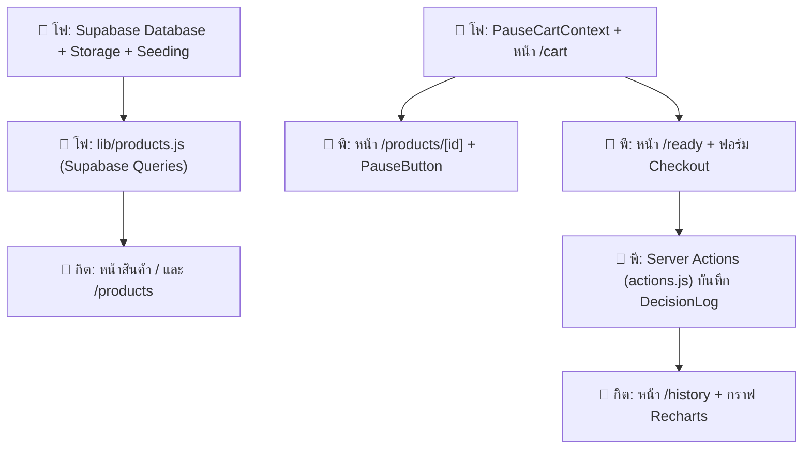

# 📖 Pause — คู่มือการพัฒนาและแบ่งงานในทีม (Team Guide)

> **มาตรฐานการออกแบบ (Design System):** โปรเจกต์นี้ใช้มาตรฐานดีไซน์จาก [`genesis-DESIGN.md`](./genesis-DESIGN.md) เป็นหลัก ทุกคนในทีมต้องปฏิบัติตามเพื่อให้ UI ทั้งเว็บไปในทิศทางเดียวกัน

---

## 🎨 สรุปมาตรฐาน UI จาก `genesis-DESIGN.md` (ข้อควรรู้ก่อนเริ่มโค้ด)

### 1. โทนสี (Color Palette)
| สี | ค่าสี | การนำไปใช้งาน |
|---|---|---|
| **Primary** | `#6366F1` (Indigo) | ปุ่ม CTA, ลิงก์สำคัญ, Active state, Focus ring (ห้ามใช้กับข้อความธรรมดา) |
| **Primary Hover** | `#4F46E5` | สีตอน hover ของปุ่มหลัก |
| **Secondary** | `#20970B` | ไฮไลต์พิเศษ |
| **Text Primary** | `#0A0A0A` | หัวข้อ, ข้อความหลัก (ห้ามใช้สีดำสนิท #000000) |
| **Text Secondary** | `#6B6B6B` | คำอธิบายย่อย, metadata |
| **Neutral / Muted** | `#9C9C9C` | Placeholder, ข้อความจาง, ป้าย disabled |
| **Border** | `#E8E8EC` | ขอบการ์ด, เส้นคั่น, ขอบ input (1px เส้นบางละเอียด) |
| **Background** | `#FAFAFA` | สีพื้นหลังของทั้งหน้าเว็บ |
| **Surface** | `#FFFFFF` | สีพื้นหลังของการ์ด, กล่องฟอร์ม, Navbar |
| **Success** | `#10B981` | ป้ายสถานะพร้อม, ปุ่มยืนยันการซื้อจริง |
| **Error / Destructive**| `#EF4444` | ปุ่มข้ามเวลา, ข้อความ validation error ของฟอร์ม |

### 2. ความโค้งมน (Border Radius) — ⚠️ กฎสำคัญ ห้ามปนกัน
- **`4px` (`rounded-[4px]`):** Tags, chips เล็ก ๆ, inline code
- **`6px` (`rounded-[6px]`):** **ปุ่มทุกตัว (Buttons), Inputs, Selects**
- **`8px` (`rounded-[8px]`):** รูปภาพขนาดย่อม, Dropdowns, Notification banners
- **`12px` (`rounded-[12px]`):** **การ์ดทุกใบ (Cards), กล่องค้นหา, Modal**
- **`9999px` (`rounded-full`):** Pill badges, สถานะตัวเลข (CartBadge)

### 3. Typography & Spacing
- **Font หลัก:** `DM Sans` สำหรับเนื้อหาและ UI ทั่วไป
- **Font ตัวเลข/โค้ด:** `JetBrains Mono` สำหรับตัวเลข Countdown และสถิติ
- **Elevation / Shadow:** การ์ดปกติจะแบนราบ (Flat) มีขอบ 1px แต่ตอน Hover จะลอยขึ้น `-2px` (`hover:-translate-y-0.5`) พร้อมเงาบางเบา (`hover:shadow-md`)

---

## 👥 ตารางแบ่งงานและความรับผิดชอบของแต่ละคน (อัปเดต: สลับงานให้โฟได้ทำ Supabase)

---

### 👤 โฟ — Supabase Data Layer, Products API, และระบบตะกร้าพัก

| ไฟล์ | หน้าที่ | สิ่งที่ต้องทำ (TODO) |
|---|---|---|
| [`supabase/schema.sql`](./supabase/schema.sql) | Database Schema | ออกแบบและรันคำสั่ง SQL สร้างตาราง `Product`, `DecisionLog`, Foreign Key, Indexes และสร้าง Bucket `product-images` บน Supabase |
| [`scripts/seed.js`](./scripts/seed.js) | Seeding Script | เขียนสคริปต์อัปโหลดรูปภาพสินค้าขึ้น Supabase Storage และยัดข้อมูลจำลองลงตาราง `Product` |
| [`lib/products.js`](./lib/products.js) | Supabase Products Query | เขียนฟังก์ชัน query ข้อมูลสินค้าจากตาราง `Product` ใน Supabase (`getProducts({ q, category })` และ `getProductById(id)`) |
| [`context/PauseCartContext.jsx`](./context/PauseCartContext.jsx) | Global State ตะกร้าพัก | จัดการ state ตะกร้าพัก, ซิงก์กับ `localStorage`, ฟังก์ชัน `addItem`, `removeItem`, `skipItem`, และสวิตช์ `devFastForward` |
| [`app/cart/page.jsx`](./app/cart/page.jsx) | หน้าตะกร้าพัก (Cooling-off) | หน้ารวมสินค้าที่กำลังนับถอยหลังพักคิด พร้อมปุ่มยกเลิก และสวิตช์ Dev FastForward |

---

### 👤 กิต — หน้ารายการสินค้า, การ์ดสินค้า, และแดชบอร์ดสถิติ

| ไฟล์ | หน้าที่ | สิ่งที่ต้องทำ (TODO) |
|---|---|---|
| [`components/ProductCard.jsx`](./components/ProductCard.jsx) | การ์ดสินค้า (UI Component) | ออกแบบการ์ดสินค้าตาม `genesis-DESIGN.md` (radius 12px, hover lift -2px, แสดงรูป, ราคา, หมวดหมู่) |
| [`components/SearchFilter.jsx`](./components/SearchFilter.jsx) | แถบค้นหาและตัวกรอง | ช่องค้นหาชื่อสินค้าและ Dropdown หมวดหมู่ ซิงก์กับ URL Query parameters (`?q=...&category=...`) |
| [`app/page.jsx`](./app/page.jsx) | หน้าแรก (Landing & Showcase) | Hero Section คอนเซปต์ "Pause" + แสดงการ์ดสินค้าแนะนำ |
| [`app/products/page.jsx`](./app/products/page.jsx) | หน้ารายการสินค้าทั้งหมด | ดึงข้อมูลสินค้าผ่าน `getProducts` แสดงใน Grid พร้อมตัวกรอง |
| [`components/Countdown.jsx`](./components/Countdown.jsx) | ตัวนับเวลาถอยหลัง | เขียน `useEffect` + `setInterval` นับถอยหลัง ชม:นาที:วินาที (JetBrains Mono) |
| [`components/HistoryChart.jsx`](./components/HistoryChart.jsx) | กราฟ Recharts | เรนเดอร์กราฟเปรียบเทียบสัดส่วน ซื้อจริง vs ไม่ซื้อ vs ข้ามเวลา |
| [`app/history/page.jsx`](./app/history/page.jsx) | หน้าสถิติ (Insights) | สรุปยอดเงินที่ประหยัดได้, ยอดซื้อจริง และแสดงกราฟ `HistoryChart` |

---

### 👤 พี — โครงสร้าง Layout, หน้ารายละเอียด, และหน้าตัดสินใจ

| ไฟล์ | หน้าที่ | สิ่งที่ต้องทำ (TODO) |
|---|---|---|
| [`app/layout.jsx`](./app/layout.jsx) & [`components/Nav.jsx`](./components/Nav.jsx) | Layout & Navbar | จัด Navbar sticky 56px, backdrop-blur, ลิงก์ 5 หน้า, และ `<CartBadge />` |
| [`components/CartBadge.jsx`](./components/CartBadge.jsx) | Badge ตัวเลขตะกร้า | แสดงจำนวนสินค้าในตะกร้าพัก (ซ่อนถ้าเป็น 0) |
| [`components/PauseButton.jsx`](./components/PauseButton.jsx) | ปุ่ม Pause & Skip | ตัวเลือกเวลานับถอยหลัง (1h–7d, custom) + ปุ่ม "หยุดคิดก่อน" และปุ่ม "ข้ามเวลา" |
| [`lib/schemas/checkout.js`](./lib/schemas/checkout.js) | Zod Schema | กฎ validation สำหรับ 4 ช่องกรอกฟอร์ม |
| [`components/CheckoutForm.jsx`](./components/CheckoutForm.jsx) | ฟอร์ม Checkout | จัดการฟอร์มด้วย `react-hook-form` + `zodResolver` |
| [`app/products/[id]/page.jsx`](./app/products/[id]/page.jsx) | หน้ารายละเอียดสินค้า | Server Component ดึงสินค้าตาม id + วาง `<PauseButton />` |
| [`app/ready/page.jsx`](./app/ready/page.jsx) | หน้าพร้อมตัดสินใจ | รายการสินค้าที่ครบเวลา พร้อมปุ่ม "ซื้อจริง" (เปิดฟอร์ม) และปุ่ม "เปลี่ยนใจ (ผ่าน)" |
| [`app/actions.js`](./app/actions.js) | Server Actions | ฟังก์ชัน `confirmPurchaseAction` และ `passItemAction` บันทึกลง Supabase `DecisionLog` |
| [`app/not-found.jsx`](./app/not-found.jsx) & [`app/error.jsx`](./app/error.jsx) | 404 & Error Boundary | หน้า 404 ไม่พบหน้า/สินค้า และหน้าดักจับ Error |
