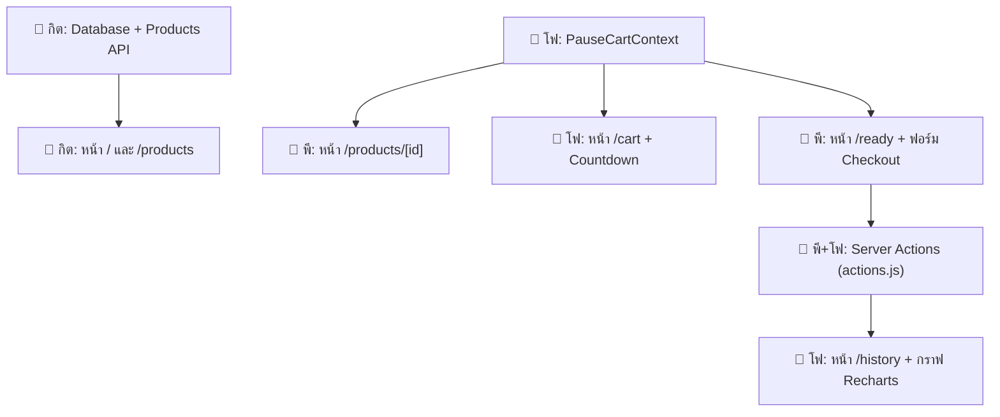

# 📖 Pause — คู่มือการพัฒนาและแบ่งงานในทีม (Team Guide)

> **มาตรฐานการออกแบบ (Design System):** โปรเจกต์นี้ใช้มาตรฐานดีไซน์จาก [`genesis-DESIGN.md`](./genesis-DESIGN.md) เป็นหลัก ทุกคนในทีมต้องปฏิบัติตามเพื่อให้ UI ทั้งเว็บไปในทิศทางเดียวกัน

---

## 🎨 สรุปมาตรฐาน UI จาก `genesis-DESIGN.md` (ข้อควรรู้ก่อนเริ่มโค้ด)

### 1. โทนสี (Color Palette)
| สี | ค่าสี | การนำไปใช้งาน |
|---|---|---|
| **Primary** | `#6366F1` (Indigo) | ปุ่ม CTA, ลิงก์สำคัญ, Active state, Focus ring (ห้ามใช้กับข้อความธรรมดา) |
| **Primary Hover** | `#4F46E5` | สีตอน hover ของปุ่มหลัก |
| **Secondary** | `#20970B` | ไฮไลต์พิเศษ |
| **Text Primary** | `#0A0A0A` | หัวข้อ, ข้อความหลัก (ห้ามใช้สีดำสนิท #000000) |
| **Text Secondary** | `#6B6B6B` | คำอธิบายย่อย, metadata |
| **Neutral / Muted** | `#9C9C9C` | Placeholder, ข้อความจาง, ป้าย disabled |
| **Border** | `#E8E8EC` | ขอบการ์ด, เส้นคั่น, ขอบ input (1px เส้นบางละเอียด) |
| **Background** | `#FAFAFA` | สีพื้นหลังของทั้งหน้าเว็บ |
| **Surface** | `#FFFFFF` | สีพื้นหลังของการ์ด, กล่องฟอร์ม, Navbar |
| **Success** | `#10B981` | ป้ายสถานะพร้อม, ปุ่มยืนยันการซื้อจริง |
| **Error / Destructive**| `#EF4444` | ปุ่มข้ามเวลา, ข้อความ validation error ของฟอร์ม |

### 2. ความโค้งมน (Border Radius) — ⚠️ กฎสำคัญ ห้ามปนกัน
- **`4px` (`rounded-[4px]`):** Tags, chips เล็ก ๆ, inline code
- **`6px` (`rounded-[6px]`):** **ปุ่มทุกตัว (Buttons), Inputs, Selects**
- **`8px` (`rounded-[8px]`):** รูปภาพขนาดย่อม, Dropdowns, Notification banners
- **`12px` (`rounded-[12px]`):** **การ์ดทุกใบ (Cards), กล่องค้นหา, Modal**
- **`9999px` (`rounded-full`):** Pill badges, สถานะตัวเลข (CartBadge)

### 3. Typography & Spacing
- **Font หลัก:** `DM Sans` สำหรับเนื้อหาและ UI ทั่วไป
- **Font ตัวเลข/โค้ด:** `JetBrains Mono` สำหรับตัวเลข Countdown และสถิติ
- **Spacing Grid:** ใช้มาตราส่วนฐาน 4px (padding: 8, 12, 16, 24px / gap: 20-24px)
- **Elevation / Shadow:** การ์ดปกติจะแบนราบ (Flat) มีขอบ 1px แต่ตอน Hover จะลอยขึ้น `-2px` (`hover:-translate-y-0.5`) พร้อมเงาบางเบา (`hover:shadow-md`)

---

## 👥 ตารางแบ่งงานและความรับผิดชอบของแต่ละคน

---

### 👤 โฟ — ระบบตะกร้าพัก, ตัวนับเวลา, และแดชบอร์ดสถิติ

| ไฟล์ | หน้าที่ | งานที่ต้องทำ (TODO) |
|---|---|---|
| [`context/PauseCartContext.jsx`](./context/PauseCartContext.jsx) | Global State ตะกร้าพัก | จัดการ state `items`, sync `localStorage` ('pause-cart'), ตรรกะ `addItem`, `removeItem`, `skipItem`, และ `readyItems` |
| [`components/Countdown.jsx`](./components/Countdown.jsx) | ตัวนับเวลา Real-time | เขียน `useEffect` + `setInterval` นับถอยหลัง, แปลงเวลา (วัน/ชม./นาที/วิ) ด้วยฟอนต์ JetBrains Mono, รองรับโหมดเร่งเวลา Dev Mode |
| [`components/HistoryChart.jsx`](./components/HistoryChart.jsx) | กราฟ Recharts | เรนเดอร์ BarChart/PieChart สรุปสัดส่วน ซื้อจริง vs ผ่าน vs ข้ามเวลา ด้วยสี Success/Indigo/Error |
| [`app/cart/page.jsx`](./app/cart/page.jsx) | หน้าตะกร้าพัก | แสดงรายการสินค้าที่กำลังนับถอยหลัง, ปุ่มยกเลิก, ปุ่มข้าม, สวิตช์ toggle เปิด/ปิด Dev Fast-forward |
| [`app/history/page.jsx`](./app/history/page.jsx) | หน้าสถิติ (Insights) | Query จาก `DecisionLog` ใน Supabase สรุปยอดเงินที่ประหยัดได้, ยอดซื้อจริง และแสดงกราฟ |

---

### 👤 กิต — Data Layer, แคตตาล็อกสินค้า, และหน้าแรก

| ไฟล์ | หน้าที่ | งานที่ต้องทำ (TODO) |
|---|---|---|
| [`supabase/schema.sql`](./supabase/schema.sql) | โครงสร้าง Database | นำคำสั่งไปรันสร้างตาราง `Product`, `DecisionLog` บน Supabase และสร้าง bucket `product-images` |
| [`scripts/seed.js`](./scripts/seed.js) | Seed ข้อมูลเริ่มต้น | ใส่รายการสินค้าตัวอย่างและอัปโหลดรูปขึ้น Supabase Storage |
| [`lib/products.js`](./lib/products.js) | Data Fetching Helper | เขียน query `getProducts({ q, category })` และ `getProductById(id)` จากตาราง Product |
| [`components/ProductCard.jsx`](./components/ProductCard.jsx) | การ์ดสินค้า (ใช้ซ้ำ) | ออกแบบการ์ด 12px radius, แสดงรูป 180-200px, ชื่อ, ราคา, หมวดหมู่, hover effect -2px |
| [`components/SearchFilter.jsx`](./components/SearchFilter.jsx) | ค้นหา & ตัวกรอง | Input ค้นหา + Select หมวดหมู่ ซิงก์ค่าลงใน URL Query String (`?q=...&category=...`) |
| [`app/page.jsx`](./app/page.jsx) | หน้าแรก (Landing) | Hero Section แนะนำ Pause concept + แสดงการ์ดสินค้าแนะนำ 3-4 ชิ้น |
| [`app/products/page.jsx`](./app/products/page.jsx) | หน้ารายการสินค้า | Server Component ดึงสินค้าตาม `searchParams` แสดงผลพร้อม `<SearchFilter />` และสถานะไม่พบสินค้า |

---

### 👤 พี — โครงสร้าง Layout, หน้ารายละเอียด, และหน้าตัดสินใจ

| ไฟล์ | หน้าที่ | งานที่ต้องทำ (TODO) |
|---|---|---|
| [`app/layout.jsx`](./app/layout.jsx) & [`components/Nav.jsx`](./components/Nav.jsx) | Layout & Navbar | จัด Navbar sticky 56px, backdrop-blur, ลิงก์ 5 หน้า, และ `<CartBadge />` แสดงจำนวนของในตะกร้า |
| [`components/CartBadge.jsx`](./components/CartBadge.jsx) | Badge ตัวเลขตะกร้า | ดึง `count` จาก `usePauseCart()` แสดง badge วงกลม (ไม่แสดงถ้า count = 0) |
| [`components/PauseButton.jsx`](./components/PauseButton.jsx) | ปุ่ม Pause & Skip | Dropdown เวลาพัก (preset: 1h–7d + custom), ปุ่ม "หยุดคิดก่อน", และปุ่ม "ข้ามไปเลย" |
| [`lib/schemas/checkout.js`](./lib/schemas/checkout.js) | Zod Validation Schema | กำหนด validation 4 ช่อง: ชื่อ-นามสกุล, ที่อยู่, เบอร์โทร, ช่องทางชำระเงิน |
| [`components/CheckoutForm.jsx`](./components/CheckoutForm.jsx) | ฟอร์ม Checkout | `react-hook-form` + `zodResolver`, แสดง error สีแดงใต้ช่อง, ปุ่มยืนยันพร้อมสถานะ Loading |
| [`app/products/[id]/page.jsx`](./app/products/[id]/page.jsx) | หน้ารายละเอียดสินค้า | Server Component ดึงข้อมูลสินค้าตาม id (ถ้าไม่พบเรียก `notFound()`) + วาง `<PauseButton />` |
| [`app/ready/page.jsx`](./app/ready/page.jsx) | หน้าพร้อมตัดสินใจ | ดึง `readyItems`, ปุ่ม "ซื้อจริง" (เปิดฟอร์ม) และปุ่ม "เปลี่ยนใจ (ผ่าน)" |
| [`app/actions.js`](./app/actions.js) | Server Actions | ฟังก์ชัน `confirmPurchaseAction` และ `passItemAction` บันทึกลง Supabase และสั่ง `revalidatePath` |
| [`app/not-found.jsx`](./app/not-found.jsx) & [`app/error.jsx`](./app/error.jsx) | 404 & Error Boundary | หน้าแจ้งเตือนเมื่อไม่พบหน้า/สินค้า และกล่องดักจับ runtime error |

---

## 🚀 ลำดับขั้นตอนการพัฒนา (Recommended Steps)

1. **สัปดาห์ที่ 1 — ก่อตั้งฐานข้อมูลและระบบตะกร้า:**
   - **กิต:** สร้างโปรเจกต์ Supabase, รัน `schema.sql`, รัน `scripts/seed.js`
   - **โฟ:** เขียน logic ใน `PauseCartContext.jsx` และทดสอบ sync กับ localStorage
   - **พี:** วางโครงสร้าง `layout.jsx`, `Nav.jsx`, 404 page

2. **สัปดาห์ที่ 2 — หน้ารายการและระบบนับเวลา:**
   - **กิต:** เชื่อมต่อ `lib/products.js`, สร้าง `ProductCard.jsx`, ทำหน้า `/` และ `/products`
   - **พี:** ทำหน้า `/products/[id]` และคอมโพเนนต์ `PauseButton.jsx`
   - **โฟ:** ทำหน้า `/cart` และคอมโพเนนต์ `Countdown.jsx`

3. **สัปดาห์ที่ 3 — การตัดสินใจและแดชบอร์ดสถิติ:**
   - **พี:** ทำหน้า `/ready`, `CheckoutForm.jsx` และเชื่อมต่อกับ `app/actions.js`
   - **โฟ:** ทำหน้า `/history` ดึงสถิติจาก `DecisionLog` และวาดกราฟ `HistoryChart.jsx`
   - **ร่วมกัน:** ทดสอบกระบวนการทั้งหมดตั้งแต่เริ่ม Pause จนถึงตัดสินใจ และทดสอบโหมดพรีเซนต์ (Dev Fast-forward)
